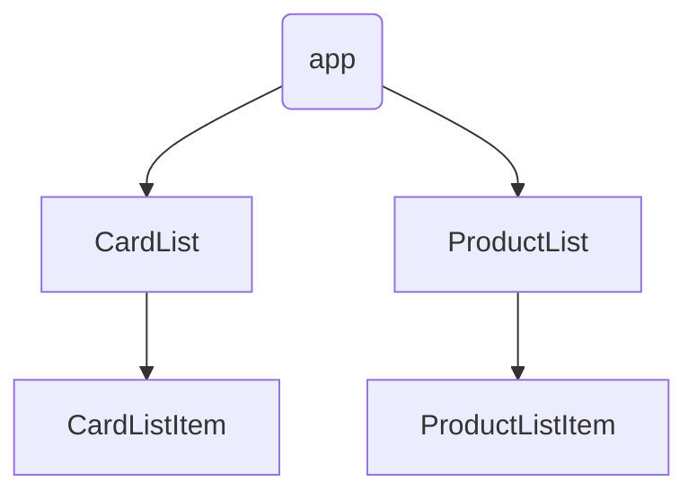
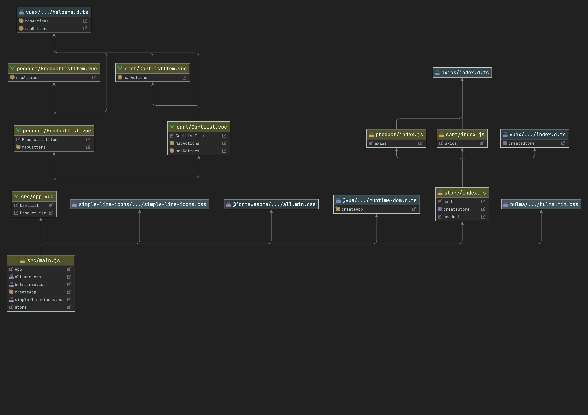

# shopping-cart: Demo Project for Vuex and vue-router implementation
## Prerequisites
* Install concurrently: `pnpm add --save concurrently`;
* Install fontawesome: `pnpm add --save @fortawesome/fontawesome-free`;
* Install bulma: `pnpm add --save bulma`

## Project setup
```
pnpm install
```

### Compiles and hot-reloads for development
```
pnpm run serve
```

### Compiles and minifies for production
```
pnpm run build
```

### Lints and fixes files
```
pnpm run lint
```





### Customize configuration
See [Configuration Reference](https://cli.vuejs.org/config/).
